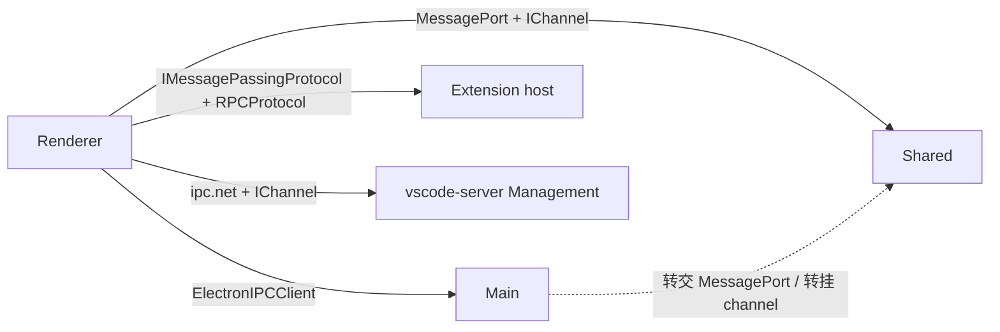

# 跨进程 Channel IPC

> 谁启动谁、入口文件见 [进程模型概览](../../systems/processes/overview.md)。分层见 [分层规则](layers.md) 与 [架构概览](../overview.md)。

跨进程调用分两层：**传输**（`IMessagePassingProtocol`：`send(VSBuffer)` / `onMessage`）和 **会话**。main / shared / remote **Management** 走 `IChannel`；extension host 共用同一传输面，会话面是 `RPCProtocol`，不是 `IChannel`。不要把两种会话协议混成一套字段表。

## 源码位置

| 层 | 路径 | 职责 |
|----|------|------|
| `base` | `src/vs/base/parts/ipc/` | 与传输无关的 channel 运行时；按环境分子目录 |
| `platform` | `src/vs/platform/ipc/` | 把 channel 接到 DI：`IMainProcessService`、`ISharedProcessService`、`registerMainProcessRemoteService` / `registerSharedProcessRemoteService` |

`base/parts/ipc/common/ipc.ts` 是 SSOT：`IChannel`、`IServerChannel`、`IPCClient`、`IPCServer`、`ProxyChannel`、`getDelayedChannel`。传输适配器另放：Electron（`ipc.electron.ts`）、`MessagePort`（`ipc.mp.ts`）、Node socket / child_process（`ipc.net.ts`、`ipc.cp.ts`）。

## Channel 抽象

`IChannel` 是一组命令：`call(command, arg?)` 返回 Promise；`listen(event, arg?)` 返回 `Event`。对端 `IServerChannel` 多一个 `TContext`（例如窗口 id）。一侧 `registerChannel(channelName, channel)`，对侧 `getChannel(channelName)`。名字是字符串约定，由登记处与调用方对齐，运行时不校验 schema。

`IPCClient` 同时实现 `IChannelClient` 与 `IChannelServer`：一条协议上双向登记 / 取 channel。`IPCServer` 在多连接上广播已登记 channel，可用 `IClientRouter` / `StaticRouter` 选对端。连接未就绪时用 `getDelayedChannel` 先交出可 `call` / `listen` 的代理。

`ProxyChannel.fromService` 把服务对象收成 `IServerChannel`；`toService` 把 `IChannel` 收成方法 / 事件代理。限制写在源码注释里：默认只自动 marshal `URI` 与 `RegExp`；事件名须 `onUpperCase`；`CancellationToken` 不走这条自动包装。需要手写编解码时用 `channelClientCtor`，不要假设所有远程服务都是 `ProxyChannel`。

`IRemoteService`（`platform/ipc/common/services.ts`）只暴露 `getChannel` / `registerChannel`。`IMainProcessService` 与 `ISharedProcessService` 都扩展它。`ISharedProcessService` 另加 `createRawConnection()` 与 `notifyRestored()`。

## Renderer → main

桌面 `workbench/electron-browser/desktop.main.ts` 用窗口 id 建 `ElectronIPCMainProcessService`，注入 `IMainProcessService`。实现是 `base/parts/ipc/electron-browser` 的 `IPCClient`：preload 的 `ipcRenderer` 发握手后走 Electron 传输（实现里的通道名是 `vscode:hello` / `vscode:message` / `vscode:disconnect`）。

Main 在 `CodeApplication.initChannels`（`code/electron-main/app.ts`）把 `IServerChannel` 挂到 `ElectronIPCServer`，并按需转给 shared 的 `MessagePortClient`。Renderer 侧两种用法：

- 直接 `mainProcessService.getChannel(name)`，再 `ProxyChannel.toService` 或手写 `*ChannelClient`
- `registerMainProcessRemoteService(id, channelName, options?)`：DI 解析时经 `MainProcessRemoteServiceStub` 取 channel

`platform/ipc/common/mainProcessService.ts` 的 `MainProcessService` 是另一实现：已有 `IPCServer` + `StaticRouter` 时用（例如 shared 回连各窗口），不是 renderer 那条 Electron 客户端。

## Renderer → shared

`ISharedProcessService`（`platform/ipc/electron-browser/services.ts`）在 renderer 实现为 `SharedProcessService`。窗口 `Restored`（或超时）之后，经 `acquirePort(SharedProcessChannelConnection.request, SharedProcessChannelConnection.response)` 向 main 要 `MessagePort`，再包成 `ipc.mp` 的 `Client`。`getChannel` 包在 `getDelayedChannel` 里。需要 `postMessage` 传 typed array 时走 `createRawConnection()`（`SharedProcessRawConnection`），调用方自己 `port.start()`。

`registerSharedProcessRemoteService` 与 main 侧 stub 对称。Shared 进程入口与「首窗才 spawn」见 [进程模型概览 · shared](../../systems/processes/overview.md)。

## Renderer → remote

存在 `remoteAuthority` 时，`AbstractRemoteAgentService` 建 `IRemoteAgentConnection`。底层 `connectRemoteAgentManagement` 打开 `ConnectionType.Management`（与 `ExtensionHost` / `Tunnel` 并列，编排见 [进程模型概览](../../systems/processes/overview.md)），得到 `ipc.net` 上的 `Client`。之后仍是 `getChannel` / `withChannel` / `registerChannel`。工作台自己用的名字包括 `remoteextensionsenvironment`、`telemetry`；远端 `ManagementConnection` 把 server 上的 channel 接到同一条 socket。

这条是 **Management** channel 面。远端 extension host / pty 是另外的 `ConnectionType`，不要当成同一个 `IChannel` 总线。

## Renderer → extension host

`IExtensionHost.start()` 只承诺 `IMessagePassingProtocol`。桌面 `NativeLocalProcessExtensionHost` 经 main 的 `ExtensionHostStarter` 拉 `WindowUtilityProcess`，用 `MessagePort` 建协议；远端 `RemoteExtensionHost` 走 `ConnectionType.ExtensionHost`。`LocalWebWorker` 在 renderer 内，不是 OS 进程。

`ExtensionHostManager._createExtensionHostCustomers` 把该协议交给 `RPCProtocol`（`workbench/services/extensions/common/rpcProtocol.ts`）。会话标识是 `ProxyIdentifier`，工作台侧经 `extHostNamedCustomer` / `IExtHostContext.getProxy` / `set` 登记，**不是** `IChannel` 的 `channelName`。扩展契约见 [Extension API](../../systems/extension-api/INDEX.md)。

本地启动 extension host 本身仍可能经 main channel（`initChannels` 登记的 extension host starter）。那是 **拉起进程**，不是 EH 里的 `vscode.d.ts` 调用。

## 选用

| 对端 | 会话面 | Renderer 入口 |
|------|--------|----------------|
| main | `IChannel` | `IMainProcessService` |
| shared | `IChannel`（另有 raw `MessagePort`） | `ISharedProcessService` |
| remote Management | `IChannel` | `IRemoteAgentService.getConnection()` |
| extension host | `RPCProtocol` | `IExtensionHost.start()` → `IRPCProtocol` |

新跨进程服务：对端登记 `IServerChannel`（或 `ProxyChannel.fromService`），本端 `getChannel` 或 `register*RemoteService`。不要为 EH API 新开 `IChannel`；不要把 Electron / `MessagePort` 事件名当成 `IChannel` 的 `command`。

## 相关文档

- [进程模型概览](../../systems/processes/overview.md) · [Processes 索引](../../systems/processes/INDEX.md)
- [分层规则](layers.md) · [架构概览](../overview.md)
- [Extension API](../../systems/extension-api/INDEX.md)
