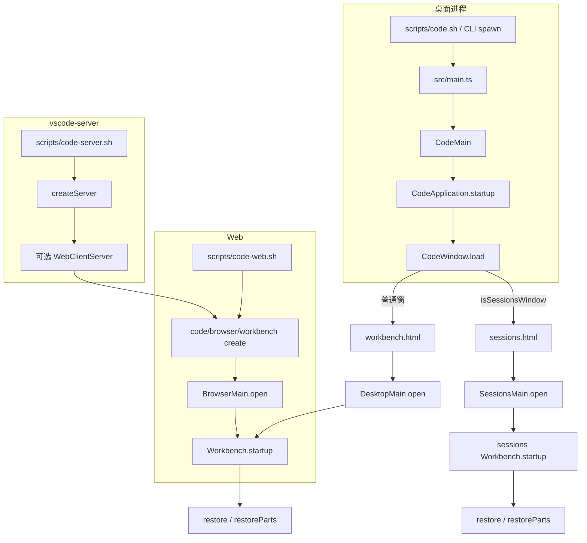

# 启动路径

> 导航：[横切索引](INDEX.md) · 全景：[架构概览](../overview.md)。入口层：[code](../../modules/code/INDEX.md) · [sessions](../../modules/sessions/INDEX.md) · [server](../../modules/server/INDEX.md)。进程谁启动谁：[进程模型](../../systems/processes/overview.md)。分层：[分层规则](layers.md)。

`code`、`server`、`sessions` 并列在 `workbench` 之上，不是互相堆叠。本文只写能对上启动器 / 入口文件的四条链，停在 `Workbench.startup()` 与 `restoreParts()`。CLI 扩展操作、`--help` / `--version` 等不启动工作台的旁路见文末。

## 四条路径

| 路径 | 进程拉起 | Renderer / 客户端壳 | 工作台入口 | `Workbench` 实现 |
|------|----------|---------------------|------------|------------------|
| **桌面 Code 窗口** | `scripts/code.sh` 或 CLI `spawn(process.execPath)` → `src/main.ts` | `CodeWindow.load()` → `code/electron-browser/workbench/workbench.html` | `workbench.desktop.main.ts` → `DesktopMain.open()` | `workbench/browser/workbench.ts` |
| **Sessions 窗口** | 同上（同一 Electron main） | `configuration.isSessionsWindow` → `sessions/electron-browser/sessions.html` | `sessions.desktop.main.ts` → `SessionsMain.open()` | `sessions/browser/workbench.ts` |
| **Web embedder** | `scripts/code-web.sh`（`@vscode/test-web`）或宿主页 | `code/browser/workbench/workbench.ts` | `create()` → `workbench.web.main.internal.ts` → `BrowserMain.open()` | `workbench/browser/workbench.ts` |
| **vscode-server** | `scripts/code-server.sh` → `src/server-main.ts` | 无桌面窗。磁盘上存在 `code/browser/workbench/workbench.html` 时挂 `WebClientServer`，之后走 Web embedder | 服务端停在 `createServer()` / 握手；UI 不在本进程 | 仅经可选 Web 客户端 |

`scripts/code-web.sh` **不**进入 `src/vs/server/`。vscode-server 的可选 Web UI 复用 `code/browser/workbench`，不是再写一套桌面壳。

## 桌面 Code 窗口

开发桌面：`scripts/code.sh` 预编译后 `exec` `.build/electron/...`。默认 CLI 分支（`src/cli.ts` → `vs/code/node/cli.ts`）清掉 `ELECTRON_RUN_AS_NODE`，`spawn(process.execPath)`（macOS 用 `open -n -g -a`）进入同一条 main。

### 1. `src/main.ts` → `CodeMain`

`src/main.ts` 在 Electron main 里先做产品引导，再加载本层：

- `perf.mark('code/didStartMain')`，随后标记 `willLoadMainBundle` / `didLoadMainBundle`
- `configurePortable`、解析 CLI、`argv.json` 开关、按条件 `app.enableSandbox()` / `no-sandbox`
- `app.setPath('userData', …)`（须在 `ready` 之前）、code cache、关掉默认菜单、按参数启动 crash reporter
- `startup()`：写入 `VSCODE_NLS_CONFIG` / `VSCODE_CODE_CACHE_PATH`，`bootstrapESM()`，再 `import('./vs/code/electron-main/main.js')`，`perf.mark('code/didRunMainBundle')`

`CodeMain`（`src/vs/code/electron-main/main.ts`）注释写明：第二次从命令行启动时会尽量连上已有实例，避免两套 VS Code 同时跑。`main()` → `startup()`：

1. 建 main 侧服务并 `initServices`
2. `claimInstance` 拿 Node IPC（失败则本进程不是第一实例，随后退出）
3. 写 `mainLockfile`
4. `CodeApplication.startup()`（`electron-main/app.ts`）

### 2. `CodeApplication` → 开窗

打开第一扇窗口之前（见 [进程模型](../../systems/processes/overview.md)）：

- 建 `ElectronIPCServer`
- `setupSharedProcess()`：对象先建，真正 `UtilityProcess` spawn 延后到**第一个窗口要连接**时
- `initServices` / `initChannels`：把 `IExtensionHostStarter`、文件系统、storage、logger 等 channel 挂到 main，并转给 shared
- 生命周期进入 `LifecycleMainPhase.Ready`，再由 `WindowsMainService` 开窗

`CodeWindow.load()`（`platform/windows/electron-main/windowImpl.ts`）默认加载 `vs/code/electron-browser/workbench/workbench.html`（源码树用 `workbench-dev.html`）。

### 3. Renderer 壳 → `DesktopMain` → `Workbench.startup`

`workbench.html` 加载 `code/electron-browser/workbench/workbench.ts`：

1. `performance.mark('code/didStartRenderer')`
2. 用 preload 的 `window.vscode` 取 `INativeWindowConfiguration`
3. `beforeImport` 里尽早 `showSplash`（`code/willShowPartsSplash` / `code/didShowPartsSplash`）。有 `partsSplash.layoutInfo` 时画一层静态 parts 占位，**不是**后面的 `restoreParts()`
4. 动态 `import` `workbench.desktop.main.ts`（dev 走相对路径），`IDesktopMain.main(configuration)`

`workbench.desktop.main.ts` 先拉 `workbench.common.main.ts`，再引入 `electron-browser/desktop.main.ts`。`main()` 构造 `DesktopMain` 并 `open()`：

1. `initServices()` 与 `domContentLoaded` 并行
2. 按配置应用 zoom，避免工作台创建后闪烁
3. `new Workbench(document.body, { extraClasses, resetLayout: configuration['disable-layout-restore'] === true }, …)`
4. `workbench.startup()`，再 `createInstance(NativeWindow)`

`Workbench`（`workbench/browser/workbench.ts`）构造时 `mark('code/willStartWorkbench')`。`startup()`：

1. `initServices`（含 `registerSingleton` 贡献的服务）
2. `initLayout`；Workbench / EditorFactory registry `start`
3. `renderWorkbench` → `createWorkbenchLayout` → `layout`
4. `restore(lifecycleService)`：先 `restoreParts()`（`layout.ts`：等 editor part ready、应用 editor layout、打开 `editorsToOpen`），再进入 `LifecyclePhase.Restored`（与慢编辑器 resolve 用 `Promise.race`，避免无限等待）

至此桌面 Code 窗口的启动链结束。本机 extension host / pty host 由 renderer 在工作台起来之后经 main 的 starter 拉起，不是这条链的前置步骤。

## Sessions 窗口（`isSessionsWindow`）

与桌面 Code 窗共享 `src/main.ts` → `CodeMain` → `CodeApplication` → `CodeWindow.load()`。分叉只在 load URL：

- `configuration.isSessionsWindow` 为真时加载 `vs/sessions/electron-browser/sessions.html`
- 仍是 Electron renderer，入口不在 `code` 层（`workbench` **不得** import `sessions`）

`sessions.html` 加载 `sessions/electron-browser/sessions.ts`，形状与 code 的 renderer 壳相同：

1. `performance.mark('code/didStartRenderer')`，preload 取配置，尽早 splash
2. 动态 `import` `sessions.desktop.main.ts`（dev 为 `./sessions.desktop.main.js`）
3. `IDesktopMain.main(configuration)`（本窗的实现在 `sessions.main.ts`，不是 `workbench/electron-browser/desktop.main.ts`）

`sessions.desktop.main.ts` 先 `import` `sessions.common.main.ts`（contribution 必须被对应 `sessions.*.main.ts` 引用才会加载），再引入 `electron-browser/sessions.main.ts`。`SessionsMain.open()`：

1. `initServices()` 与 `domContentLoaded` 并行，应用 zoom
2. `createSessionsWorkbench(document.body, { extraClasses }, …)`（`sessions/browser/workbenchFactory.ts`）
3. `workbench.startup()`，再 `NativeWindow`（macOS 或 `hasNativeMenu` 时另建 `NativeMenubarControl`）

此处的 `Workbench` 是 `sessions/browser/workbench.ts`，不是 `workbench/browser/workbench.ts`。`startup()` 同样 init services / layout / registry / render / `createWorkbenchLayout` / `layout`，最后 `restore()`：

- `restoreParts()`：按可见 part 打开默认 view container（注释：open default view containers）
- `sessionsService.restoreVisibleSessions()`（网格里上次可见的 session）
- `lifecycleService.phase = LifecyclePhase.Restored`

按 session 捕获与恢复布局的规格在 [`LAYOUT_CONTROLLER.md`](../../../src/vs/sessions/LAYOUT_CONTROLLER.md)，本文不展开。

## Web embedder

纯浏览器工作台，不经过 Electron main。

开发：`scripts/code-web.sh` 用 `@vscode/test-web` 喂 `src/vs/code/browser/workbench/`，**不**走 `src/vs/server/`。vscode-server 在磁盘上存在同一套 `workbench.html` 时，由 `WebClientServer` 提供同一入口。

`code/browser/workbench/workbench.ts`：

1. 读 DOM `#vscode-workbench-web-configuration` 的 `data-settings`（缺失则抛错）
2. 调用从 `workbench.web.main.internal.ts` 导入的 `create(document.body, options)`

`workbench.web.main.internal.ts` 再导出 `browser/web.factory.ts` 的 `create`。`create()` 注释：在给定容器里创建工作台；同一上下文只能创建一次。它 `mark('code/didLoadWorkbenchMain')`，然后 `new BrowserMain(domElement, options).open()`。

`BrowserMain.open()`（`workbench/browser/web.main.ts`）：

1. `initServices()` 与 `domContentLoaded` 并行
2. `createWorkbench` → `workbench/browser/workbench.ts` 的 `Workbench`
3. `workbench.startup()`，再 `createInstance(BrowserWindow)`

之后的 `startup()` / `restore()` / `restoreParts()` 与桌面 Code 窗口同一套 `Workbench` 类。

## vscode-server

远程开发服务端，本身是 Node 进程，不跑 renderer。

`scripts/code-server.sh` spawn `out/server-main.js`（默认 `VSCODE_SERVER_PORT=9888`）。仓库根 `src/server-main.ts`：扩展查询 / 安装且无 `--start-server` 时 `spawnCli()`；否则 `createServer()`。`src/server-cli.ts` 直接加载 `server.cli.ts`，不进这条 `createServer` 链。

`createServer`（`vs/server/node/server.main.ts` → `remoteExtensionHostAgentServer.ts`）：

1. 准备 `REMOTE_DATA_FOLDER`（`args['server-data-dir']` 或 `VSCODE_AGENT_FOLDER` 或 `~/${product.serverDataFolderName}`，默认常写作 `~/.vscode-remote`）
2. `setupServerServices()`：远端文件、扩展、终端、MCP 等 channel
3. `RemoteExtensionHostAgentServer` 接受连接；握手后按 `ConnectionType`（`platform/remote/common/remoteAgentConnection.ts`）分发：

| `ConnectionType` | 行为 |
|------------------|------|
| `Management` | `ManagementConnection`，接入 `SocketServer` 上的远端服务 channel |
| `ExtensionHost` | 新建或重连 `ExtensionHostConnection` 并 `start()`（`VSCODE_ESM_ENTRYPOINT=vs/workbench/api/node/extensionHostProcess`） |
| `Tunnel` | `_createTunnel`：把 socket 接到 `host:port` |

pty 由 `NodePtyHostStarter` fork，不在 renderer 里跑。

**到工作台的唯一跳转**：存在 `vs/code/browser/workbench/workbench.html` 时启用 `WebClientServer`（静态资源 + Web workbench）。浏览器加载该 HTML 后，序列与上一节 Web embedder 相同，直到 `BrowserMain.open()` → `Workbench.startup()` → `restoreParts()`。

桌面 renderer 带 `remoteAuthority` 连上时，本地窗口已经走完「桌面 Code 窗口」链；远端 extension host / pty host 由本进程拉起，不再走 main 里的 `ExtensionHostStarter` / `ElectronPtyHostStarter`。那不是第四条「从 spawn 到 `Workbench.startup`」的独立 UI 链。

## 不进入 `Workbench.startup` 的旁路

这些入口在源码里存在，但停在工作台之前：

| 入口 | 停在 |
|------|------|
| `vs/code/node/cli.ts` 的 `--help` / `--version` / `--locate-shell-integration-path` | 本进程打印后结束 |
| `shouldSpawnCliProcess()`（`--list-extensions`、`--install-extension`、`--telemetry` 等） | `cliProcessMain.ts` 的 `CliMain` |
| `NATIVE_CLI_COMMANDS`（如 `tunnel`） | 另 spawn tunnel 可执行文件或 dev 下的 `cargo` |
| `src/server-main.ts` 的 `spawnCli()` | `remoteExtensionHostAgentCli.ts` |
| `src/server-cli.ts` | `server.cli.ts`（管道 `VSCODE_IPC_HOOK_CLI` 或 `VSCODE_CLIENT_COMMAND`） |

## 相关文档

- [分层规则](layers.md) · [架构概览](../overview.md)
- [code 索引](../../modules/code/INDEX.md) · [sessions 索引](../../modules/sessions/INDEX.md) · [server 索引](../../modules/server/INDEX.md)
- [进程模型概览](../../systems/processes/overview.md)
- [Workbench 索引](../../modules/workbench/INDEX.md)（`Workbench.startup()` → parts → restore）
