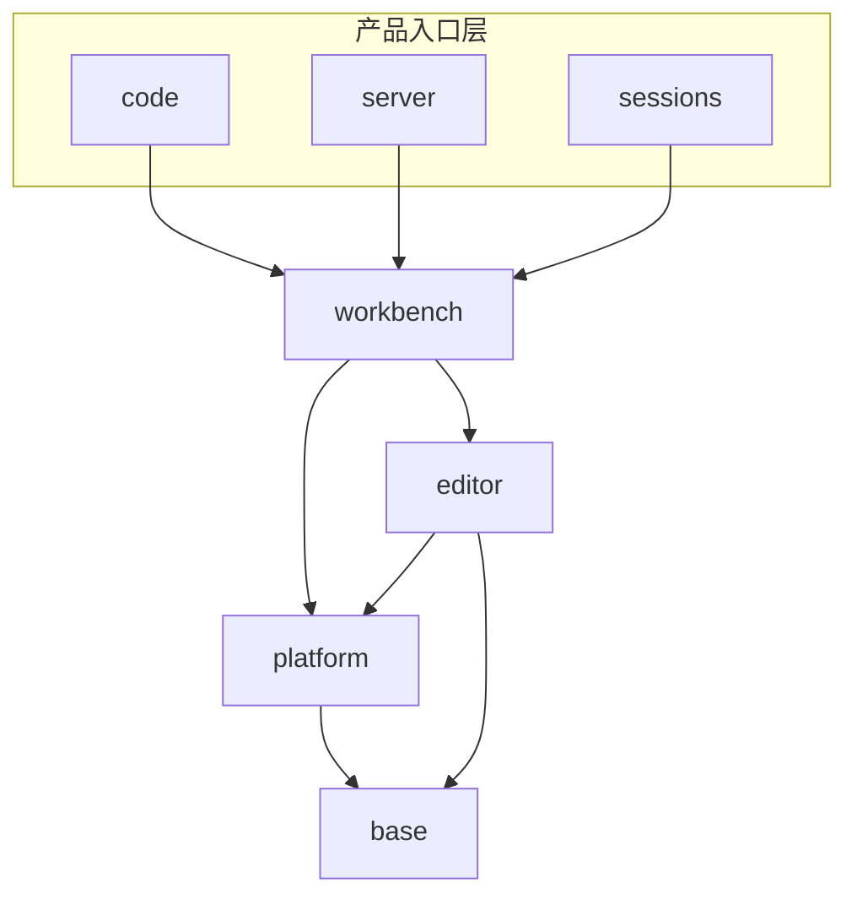

# VS Code 架构概览

> 横切规则见 [分层规则](cross-cutting/layers.md)。官方组织约定：[.github/instructions/source-code-organization.instructions.md](../../.github/instructions/source-code-organization.instructions.md)。

本仓库是分层单体：核心运行时在 `src/vs/`，内置扩展在 `extensions/`，公共 API 类型在 `src/vscode-dts/`。`docs/modules/` 只做分层导航，不承载大段设计正文。

## 仓库根目录

| 路径 | 职责 |
|------|------|
| `src/` | TypeScript 主源码；单元测试在 `src/vs/*/test/` |
| `src/vs/` | 有序分层核心（见下表） |
| `src/vscode-dts/` | 对外 `vscode.d.ts` 声明 |
| `extensions/` | 随产品发布的一等扩展（语言、git、主题等），经 Extension API 接入工作台 |
| `test/` | 集成测试与测试基础设施 |
| `build/` | 构建、CI、分层检查器 |
| `scripts/` | 开发与构建脚本 |
| `resources/` | 图标、主题等静态资源 |
| `out/` | 编译产物（生成目录） |

`src/` 根上还有进程引导：`main.ts`（桌面）、`cli.ts`、`server-main.ts`、`server-cli.ts`，以及 `bootstrap-*.ts`。它们加载 `vs/code` 或 `vs/server`，本身不是独立分层。

`src/vs/` 根文件：`nls.ts`（本地化入口）、`amdX.ts`、`monaco.d.ts`。目录层只有 `base`、`platform`、`editor`、`workbench`、`sessions`、`code`、`server`。

## 分层全景

每一层只能依赖更低层。`code`、`server`、`sessions` 都在 `workbench` 之上，彼此是产品入口层，不是互相堆叠的下一层。

反向禁止：`workbench` 不得依赖 `sessions`。`sessions` 内部再分层见就近 SSOT [`src/vs/sessions/LAYERS.md`](../../src/vs/sessions/LAYERS.md)。

## 分层职责

| 层 | 源码 | 职责 | 导航 |
|----|------|------|------|
| **base** | `src/vs/base/` | 无服务依赖的工具与 UI 积木 | [INDEX](../modules/base/INDEX.md) |
| **platform** | `src/vs/platform/` | DI 与跨层基础服务（按服务分子目录） | [INDEX](../modules/platform/INDEX.md) |
| **editor** | `src/vs/editor/` | Monaco 核心；无 `node` / `electron-*` 依赖 | [INDEX](../modules/editor/INDEX.md) |
| **workbench** | `src/vs/workbench/` | 工作台框架、services、contrib | [INDEX](../modules/workbench/INDEX.md) |
| **sessions** | `src/vs/sessions/` | Agents Window；可依赖 workbench | [INDEX](../modules/sessions/INDEX.md) |
| **code** | `src/vs/code/` | Electron 桌面入口（main / renderer / shared / CLI） | [INDEX](../modules/code/INDEX.md) |
| **server** | `src/vs/server/` | 远程开发服务端入口 | [INDEX](../modules/server/INDEX.md) |

文档把两块 workbench 子树标成**虚拟模块**（不是独立层，不能向上被更低层依赖）：

| 虚拟模块 | 源码 | 导航 |
|----------|------|------|
| **chat** | `src/vs/workbench/contrib/chat/` | [INDEX](../modules/chat/INDEX.md) |
| **workbench-api** | `src/vs/workbench/api/` | [INDEX](../modules/workbench-api/INDEX.md) |

## 目标环境（摘要）

层内再按运行时分子目录。可用 API 只能向下兼容，不能反向引用更高环境：

| 子目录 | 可用 API | 可依赖 |
|--------|----------|--------|
| `common` | 纯 JavaScript | — |
| `browser` | Web / DOM | `common` |
| `node` | Node.js | `common` |
| `electron-browser` | 浏览器 + 有限 Electron IPC | `common`、`browser` |
| `electron-utility` | Electron utility process | `common`、`node` |
| `electron-main` | Electron main process | `common`、`node`、`electron-utility` |

`editor` 只有 `common` / `browser`（另有 `contrib/`、`standalone/`）。`server` 只有 `node`。完整规则与各层实目录见 [分层规则](cross-cutting/layers.md)。

## 工作台组织

`src/vs/workbench/` 不是扁平功能堆，而是：

- `{common,browser,electron-browser}` — 最小工作台核心（layout、parts、window）
- `services/` — 核心服务（非 contrib 专属）
- `contrib/` — 功能贡献；外部不得依赖 `contrib/` 内部；每个贡献一个 `.contribution.ts`
- `api/` — Extension Host 与 `vscode.d.ts` 实现（`browser` / `common` / `node` / `worker`）

只有被入口文件引用的代码才会打进产物：`workbench.common.main.ts`、`workbench.desktop.main.ts`、`workbench.web.main.ts`（及 `.web.main.internal.ts`）。

## 进程与入口

桌面产品由 `src/main.ts` 进入 `vs/code`，再拉起多个进程：

| 进程 | 主要入口 |
|------|----------|
| Electron main | `src/vs/code/electron-main/main.ts`、`app.ts` |
| Renderer（工作台） | `src/vs/code/electron-browser/workbench/workbench.ts` → `workbench.desktop.main.ts` → `electron-browser/desktop.main.ts` |
| Shared / utility | `src/vs/code/electron-utility/sharedProcess/sharedProcessMain.ts` |
| CLI | `src/vs/code/node/cli.ts`、`cliProcessMain.ts` |
| Web 工作台 | `src/vs/code/browser/workbench/workbench.ts` → `workbench.web.main.ts` → `browser/web.main.ts` |
| Remote server | `src/vs/server/node/server.main.ts`（由 `src/server-main.ts` 引导） |
| Agents Window | `sessions.common.main.ts` / `.desktop.main.ts` / `.web.main.ts`；桌面引导 `sessions/electron-browser/sessions.ts` |
| Monaco 独立 | `src/vs/editor/editor.main.ts` |

Extension Host 由 `workbench/api` 实现，与 renderer 分进程。跨进程协作见 [Processes](../systems/processes/INDEX.md)。

## 运行时原则

- **分层**：依赖只指向更低层；改 import 边界时跑 `npm run valid-layers-check`（`build/checker/layersChecker.ts` + `layersTypeCheck.ts`）。
- **依赖注入**：服务经构造函数装饰器注入，由 `registerSingleton` 提供；非服务参数必须排在服务参数之前。
- **贡献模型**：功能向 registry / extension point 注册，而不是互相直连内部实现。
- **跨平台**：`common` 与平台抽象隔开 DOM / Node / Electron。

## 跨层系统

| 系统 | 索引 | 覆盖 |
|------|------|------|
| Editor | [INDEX](../systems/editor/INDEX.md) | Monaco 与语言服务 |
| Workbench | [INDEX](../systems/workbench/INDEX.md) | 布局、parts、services、contrib |
| Sessions | [INDEX](../systems/sessions/INDEX.md) | Agents Window；规则 SSOT 在 `src/vs/sessions/` |
| Chat | [INDEX](../systems/chat/INDEX.md) | Chat 模型、工具、编辑会话 |
| Extension API | [INDEX](../systems/extension-api/INDEX.md) | `vscode.d.ts` 与 extension host |
| Processes | [INDEX](../systems/processes/INDEX.md) | main / renderer / shared / ext host / server |

## 相关文档

- [分层规则](cross-cutting/layers.md) · [横切索引](cross-cutting/INDEX.md)
- [全局索引](../INDEX.md)
- [编码约定](../../.github/copilot-instructions.md)
