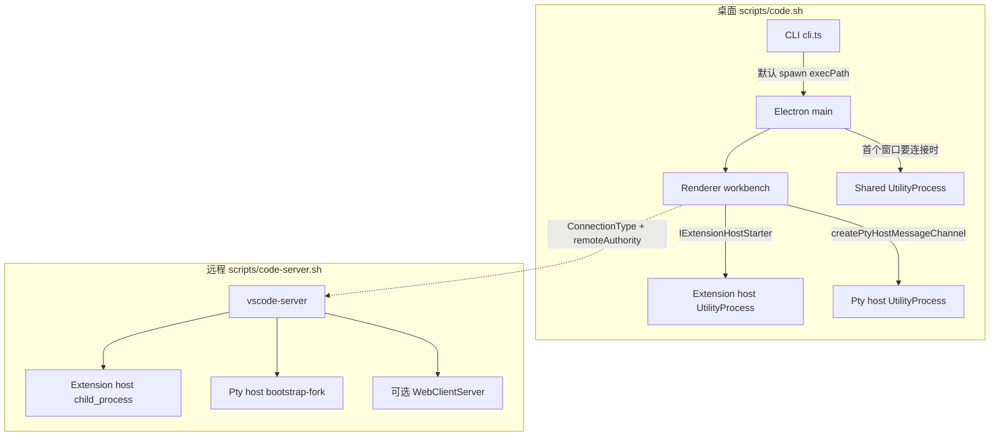

# 进程模型概览

> 导航见 [INDEX](INDEX.md)。桌面入口 [modules/code](../../modules/code/INDEX.md)，远程入口 [modules/server](../../modules/server/INDEX.md)，工作台 [modules/workbench](../../modules/workbench/INDEX.md)，扩展契约 [Extension API](../extension-api/INDEX.md)。

本文只写能在源码里对上启动器 / 入口的进程。没有单独 starter、也没有被用户指定的进程（例如文件监视 worker、agent host utility process）不展开。`ExtensionHostKind.LocalWebWorker` 是 renderer 内的 worker，不是 OS 进程。

## 两条编排链

桌面 renderer 连远程时，远端的 extension host / pty host 由 vscode-server 拉起，不再走 main 里的 `ExtensionHostStarter` / `ElectronPtyHostStarter`。

## 进程一览

| 进程 | 运行时 | 谁启动 | 入口 |
|------|--------|--------|------|
| **main** | Electron main | `src/main.ts` → `vs/code/electron-main/main.ts` | `CodeMain` → `CodeApplication` |
| **renderer / workbench** | Electron `BrowserWindow` 或浏览器 | main `CodeWindow.load()`，或 WebClientServer / `@vscode/test-web` | 桌面 `code/electron-browser/workbench`；Web `code/browser/workbench` |
| **shared** | Electron `UtilityProcess`（`type: shared-process`） | main `SharedProcess`，等**第一个窗口**要连时再 `start()` | `vs/code/electron-utility/sharedProcess/sharedProcessMain` |
| **extension host** | 桌面 `WindowUtilityProcess`；远端 `child_process` | 桌面 `ExtensionHostStarter`；远端 `ExtensionHostConnection` | `vs/workbench/api/node/extensionHostProcess` |
| **pty host** | 桌面 `UtilityProcess`（`type: ptyHost`）；远端 `bootstrap-fork` | 桌面 `ElectronPtyHostStarter`；远端 `NodePtyHostStarter` | `vs/platform/terminal/node/ptyHostMain` |
| **CLI** | Node / `ELECTRON_RUN_AS_NODE` | `src/cli.ts` 或 `scripts/code-cli.sh` | `vs/code/node/cli.ts`；扩展操走 `cliProcessMain.ts` |
| **vscode-server** | Node | `src/server-main.ts` / `scripts/code-server.sh` | `vs/server/node/server.main.ts` → `createServer()` |

## main

`CodeMain`（`src/vs/code/electron-main/main.ts`）注释写明：第二次从命令行启动时会尽量连上已有实例，避免两套 VS Code 同时跑。它先建 main 侧服务，再 `claimInstance` 拿 Node IPC；成功后 `CodeApplication.startup()`（`app.ts`）。

`CodeApplication` 在打开第一扇窗口之前：

- 建 `ElectronIPCServer`
- `setupSharedProcess()`（对象先建，真正 spawn 延后）
- `initServices` / `initChannels`：把 `IExtensionHostStarter`、文件系统、storage、logger 等 channel 挂到 main，并转给 shared
- 生命周期进入 `LifecycleMainPhase.Ready`，再由 `WindowsMainService` 开窗

开发桌面：`scripts/code.sh` 预编译后 `exec` `.build/electron/...`。

## renderer / workbench

桌面窗口 URL 由 `platform/windows/electron-main/windowImpl.ts` 的 `CodeWindow.load()` 决定：

- 普通窗口：`vs/code/electron-browser/workbench/workbench.html`（源码树用 `workbench-dev.html`）
- `configuration.isSessionsWindow`：`vs/sessions/electron-browser/sessions.html`（仍是 renderer，入口不在 `code`）

`workbench.html` 加载 `workbench.ts`。该文件 `performance.mark('code/didStartRenderer')`，用 preload 的 `window.vscode` 取配置，再动态 `import` `workbench.desktop.main.ts`，调用 `IDesktopMain.main(configuration)`。工作台框架见 [modules/workbench](../../modules/workbench/INDEX.md)。

Web：`src/vs/code/browser/workbench/workbench.ts` 调用 `workbench.web.main.internal.ts` 的 `create`。vscode-server 在磁盘上存在该 `workbench.html` 时启用 `WebClientServer`。`scripts/code-web.sh` 用 `@vscode/test-web` 喂同一套 browser 入口，不经过 `src/vs/server/`。

## shared

`platform/sharedProcess/electron-main/sharedProcess.ts` 用 `UtilityProcess.start({ type: 'shared-process', entryPoint: 'vs/code/electron-utility/sharedProcess/sharedProcessMain' })`。`whenIpcReady` 会先 `firstWindowConnectionBarrier.wait()`：没有窗口来连就不会 spawn。

`SharedProcessMain.init()` 注册跨窗口服务（扩展管理、user data sync、telemetry、tunnel、MCP、语言包等），并实例化缓存 / 日志 / 配置清理 contrib。窗口经 `SharedProcessChannelConnection` / `SharedProcessRawConnection` 向 main 要 MessagePort，再直连 shared。关闭时 main 发 `SharedProcessLifecycle.exit`。

## extension host

`ExtensionHostKind`（`workbench/services/extensions/common/extensionHostKind.ts`）：

| 种类 | 含义 |
|------|------|
| `LocalProcess` | 本机独立进程 |
| `LocalWebWorker` | renderer 内 worker，不是本表进程 |
| `Remote` | vscode-server 上的进程 |

桌面 `LocalProcess`：renderer `NativeLocalProcessExtensionHost` 经 IPC 调 main 的 `ExtensionHostStarter`。`WindowUtilityProcess.start({ type: 'extensionHost', entryPoint: 'vs/workbench/api/node/extensionHostProcess' })`。渲染侧也会设 `VSCODE_ESM_ENTRYPOINT` 为同一路径。

远端：`ExtensionHostConnection` `spawn` 子进程，环境变量同样是 `VSCODE_ESM_ENTRYPOINT=vs/workbench/api/node/extensionHostProcess`。连接类型 `ConnectionType.ExtensionHost`，支持 reconnection token。实现与 `vscode.d.ts` 面见 [Extension API](../extension-api/INDEX.md)。

## pty host

终端不在 renderer 里跑 PTY。

- **桌面**：`ElectronPtyHostStarter.start()` → `UtilityProcess` `type: 'ptyHost'`，`entryPoint: 'vs/platform/terminal/node/ptyHostMain'`。窗口用 `vscode:createPtyHostMessageChannel` 向 main 要直连 port（`localTerminalBackend.ts`）。
- **vscode-server**：`serverServices.ts` 用 `NodePtyHostStarter` + `PtyHostService`。starter `new Client(FileAccess.asFileUri('bootstrap-fork').fsPath, { args: ['--type=ptyHost', ...], env.VSCODE_ESM_ENTRYPOINT: 'vs/platform/terminal/node/ptyHostMain' })`。`RemoteTerminalChannel` 把创建进程等请求转到这台 pty host。

## CLI

仓库根 `src/cli.ts` 设 `VSCODE_CLI=1` 后加载 `vs/code/node/cli.ts`。`main(argv)`：

1. `NATIVE_CLI_COMMANDS`（如 `tunnel`）→ 另 spawn tunnel 可执行文件或 dev 下的 `cargo`（不是 Electron main）
2. `--help` / `--version` / `--locate-shell-integration-path` 等在本进程打印
3. `shouldSpawnCliProcess()`（`--list-extensions`、`--install-extension`、`--telemetry` 等）→ 动态 `import` `cliProcessMain.ts` 的 `CliMain`，不启动工作台
4. 默认分支：清掉 `ELECTRON_RUN_AS_NODE`，`spawn(process.execPath, ...)`（macOS 用 `open -n -g -a`）进入 main

`scripts/code-cli.sh` 显式 `ELECTRON_RUN_AS_NODE=1` 跑 `out/cli.js`。远端另有 `src/server-cli.ts` → `server.cli.ts`（管道或 Windows 侧客户端命令），以及 `server.main.ts` 的 `spawnCli()` → `remoteExtensionHostAgentCli.ts`。

## vscode-server

`src/server-main.ts` 解析 argv：扩展查询 / 安装且无 `--start-server` 时走 `spawnCli()`；否则 `createServer()`。`scripts/code-server.sh` spawn `out/server-main.js`。

`createServer`（`remoteExtensionHostAgentServer.ts`）→ `setupServerServices` → `RemoteExtensionHostAgentServer`。握手后：

| `ConnectionType` | 行为 |
|------------------|------|
| `Management` | `ManagementConnection`，接入 `SocketServer` 上的远端服务 channel |
| `ExtensionHost` | 新建或重连 `ExtensionHostConnection` 并 `start()` |
| `Tunnel` | `_createTunnel`：把 socket 接到 `host:port` |

数据目录：`args['server-data-dir']` 或 `VSCODE_AGENT_FOLDER` 或 `~/${product.serverDataFolderName}`。Web UI 仅当 `vs/code/browser/workbench/workbench.html` 存在时挂 `WebClientServer`。

## 相关文档

- [Processes 索引](INDEX.md)
- [modules/code](../../modules/code/INDEX.md) · [modules/server](../../modules/server/INDEX.md)
- [modules/workbench](../../modules/workbench/INDEX.md) · [Extension API](../extension-api/INDEX.md)
- [架构概览 · 进程与入口](../../architecture/overview.md)
