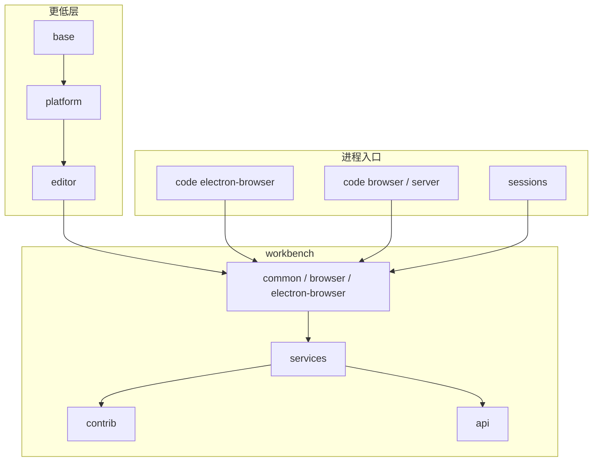

# Workbench 系统概览

> 导航见 [INDEX](INDEX.md)。分层目录与贡献规则见 [modules/workbench/overview](../../modules/workbench/overview.md)。  
> 不在此展开 Chat 或 Extension Host：请到 [chat](../../modules/chat/INDEX.md)、[workbench-api](../../modules/workbench-api/INDEX.md)。

Workbench 系统是「把编辑器变成 IDE」的跨层协作：`base`/`platform` 提供积木与 DI，`editor` 提供 Monaco，`workbench` 提供 chrome 与服务，`code`/`server` 负责把入口打进对应进程，扩展经 `workbench/api` 接入同一运行时。

## 布局契约（跨层可见）

窗口结构由 `IWorkbenchLayoutService` + `Parts` 定义，实现落在 `Layout`。默认 Code 窗口创建 titlebar、banner、activitybar、sidebar、**conversation**、editor、panel、auxiliarybar、statusbar。M0 中心叶为 `CONVERSATION_PART`，`EDITOR_PART` 在 End 列。`base` 的 `SerializableGrid` 负责分割与持久化；`platform` 的 configuration / storage 记住可见性、侧栏左右、panel 位置、Zen Mode。

功能层（contrib 或扩展）**不直接 new Part**。它们注册：

- **View container** → sidebar / panel / auxiliarybar（`ViewContainerLocation`）
- **Editor pane + `EditorInput`** → `EDITOR_PART`（`IEditorService` / `IEditorGroupsService`）
- **Status bar / title / banner** 条目 → 对应 chrome 服务

`SESSIONS_PART`、`CUSTOM_VIEW_GRID_PART` 以及 `WindowEnablement.Sessions` 把同一套视图体系接到 Agents Window；sessions 层可以依赖 workbench，**workbench 不得依赖 sessions 业务**。细节见 [sessions](../../modules/sessions/INDEX.md)。

辅助窗口（`IAuxiliaryWindowService`）复用 editor part 等多窗口 part，而不是再起一套 workbench 类。

## 服务注入与进程分工

工作台服务是 `platform` DI 的延续：构造函数 `@IFooService` + `registerSingleton`。实现按目标环境分叉，入口选择哪一份：

| 关注点 | 共用（`common.main`） | 桌面（`desktop.main`） | Web（`web.main`） |
|--------|----------------------|------------------------|-------------------|
| 启动器 | `Workbench` | `DesktopMain` + `NativeWindow` | `browser/web.main.ts` + `BrowserWindow` |
| 文本文件 | `services/textfile/common` | `electron-browser/nativeTextFileService` | `browser/browserTextFileService` |
| 生命周期 / Host | 接口在 `services/lifecycle`、`host` | native IPC | browser host |
| 扩展扫描 | 共用契约 | `electron-browser` scanners | `webExtensionsScannerService` 等 |

`code` 层只负责加载包：桌面 `workbench.desktop.main.js`，Web embedder `workbench.web.main.internal.js`（稳定 `create` 导出）。远程窗口仍跑同一套 workbench，文件 / 扩展经 `services/remote` 打到 `server`。进程拓扑见 [systems/processes](../processes/INDEX.md)。

## Contrib 与扩展的同一插入面

内置功能与扩展插件插入同一组 registry：

- `IWorkbenchContributionsRegistry` + `WorkbenchPhase`（启动相位）
- `EditorExtensions`（pane / input factory）
- Views / menus / configuration / commands（`platform` + workbench extension points）

因此 **contrib 规则是系统级契约**，不只是文件夹礼貌：

- `contrib/` **外部**（含 `services/`、`api/`、其他层）不得依赖 contrib 内部
- 跨 contrib 只走该贡献的 **单一 common API 文件**
- 未从 `workbench.*.main.ts` 引用的模块不会进包

Chat 是 contrib 里体量最大的一块，按虚拟模块单独建档（[modules/chat](../../modules/chat/INDEX.md)）。`workbench/api` 把扩展进程的 `vscode.*` 映射到上述服务（[workbench-api](../../modules/workbench-api/INDEX.md)），同样禁止 api 实现去 import 某个 contrib 的内部路径。

## 与 Editor 系统的边界

`editor` 层不知道 workbench parts。Workbench 在 `workbench.common.main.ts` 先 `import '../editor/editor.all.js'`，再用 `services/editor`（`IEditorService`、`IEditorGroupsService`、`IEditorPaneService`）把 `ICodeEditor` 放进 editor group。工作台特有的输入模型（`EditorInput`、`DiffEditorInput`、side-by-side）住在 `workbench/common/editor/`，不是 Monaco 核心。语言功能协作见 [systems/editor](../editor/INDEX.md)。

## 相关文档

- [modules/workbench](../../modules/workbench/INDEX.md)
- [chat](../../modules/chat/INDEX.md) · [workbench-api](../../modules/workbench-api/INDEX.md) · [sessions](../../modules/sessions/INDEX.md)
- [Editor](../editor/INDEX.md) · [Extension API](../extension-api/INDEX.md) · [Processes](../processes/INDEX.md)
- [分层规则](../../architecture/cross-cutting/layers.md)
